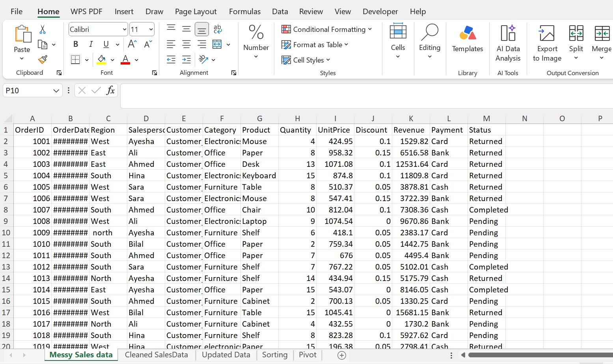
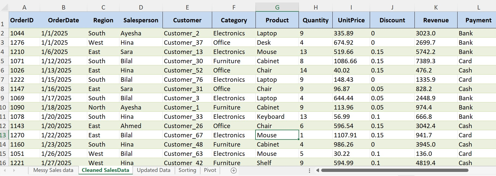
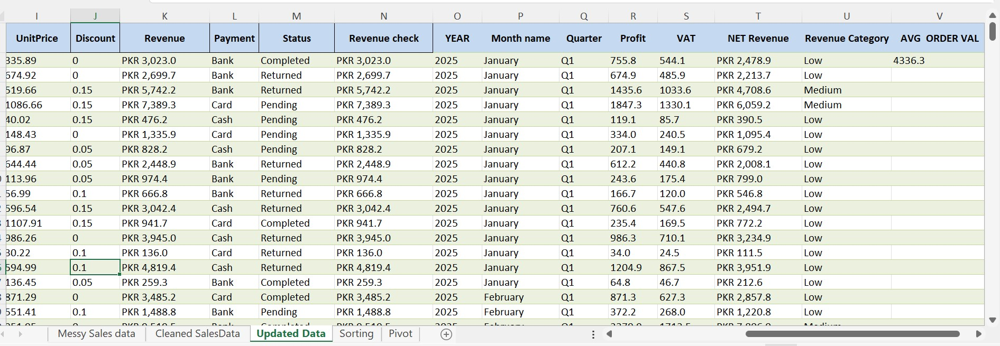
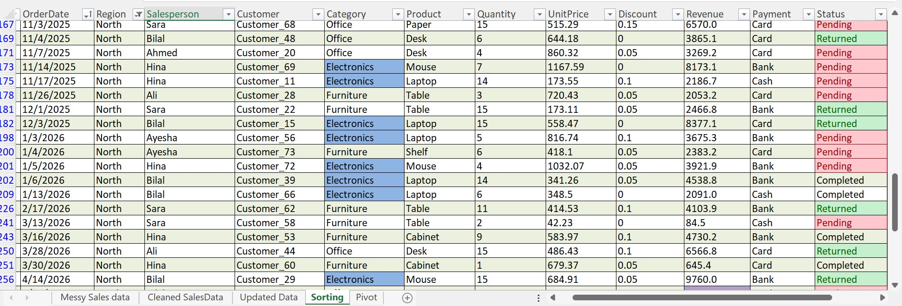
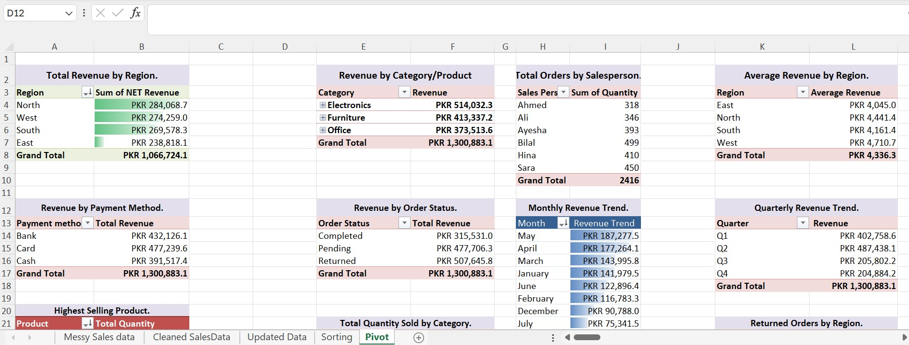
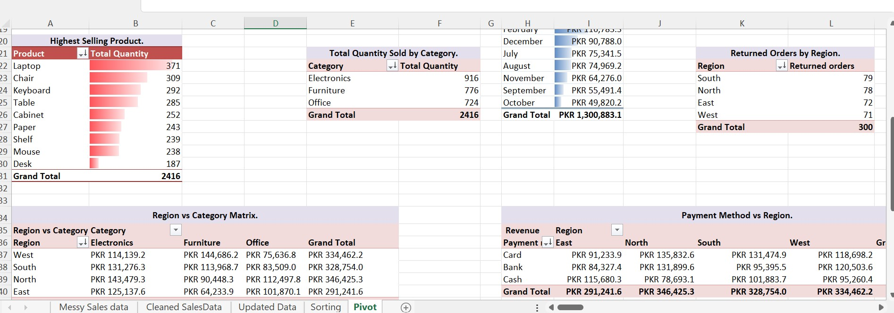
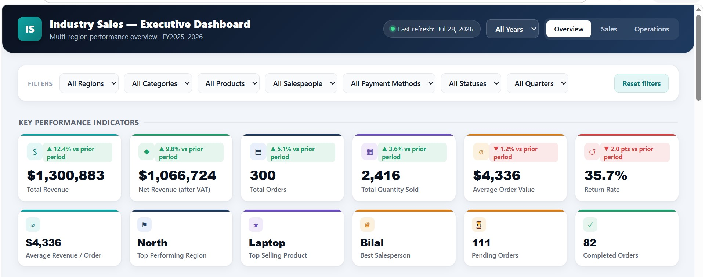
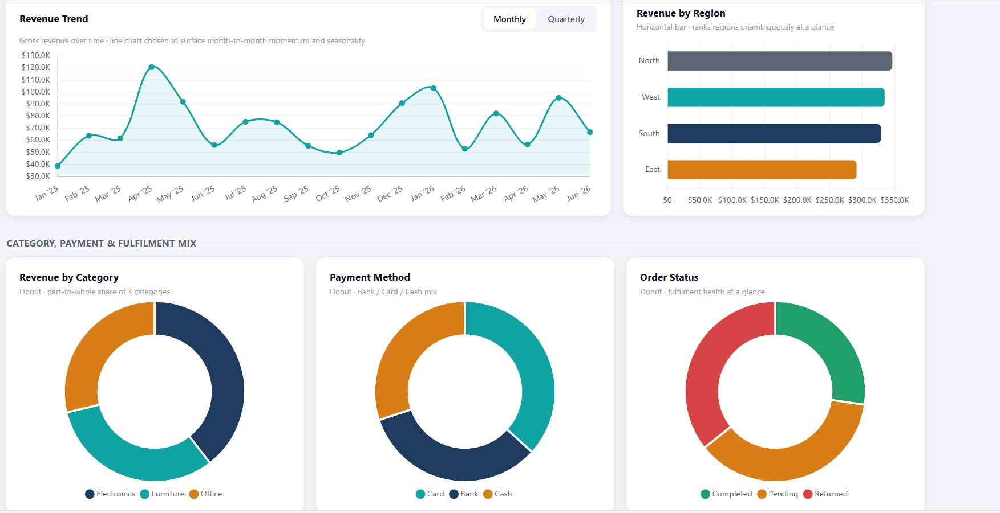
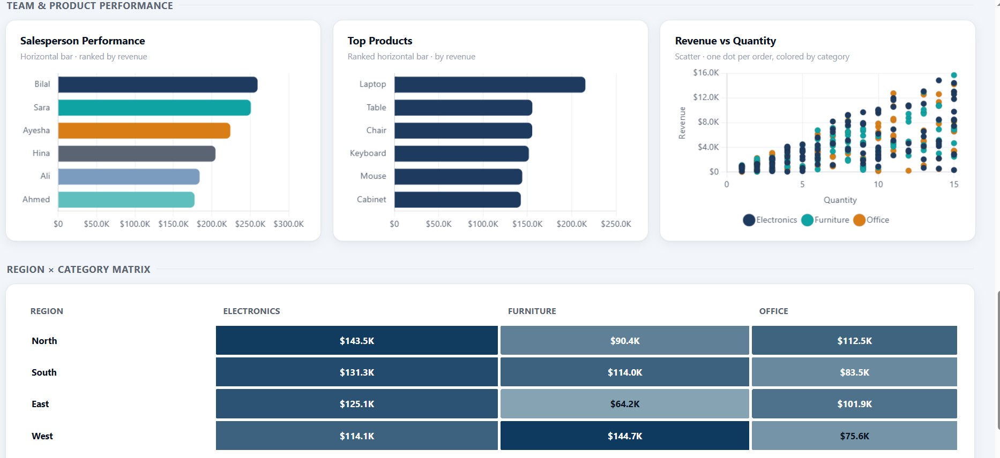

# industry-sales-executive-dashboard
Interactive Executive Sales Dashboard built with Excel using KPIs, Pivot Tables, Charts, and Business Intelligence techniques to analyze sales performance

# 📊 Industry Sales Executive Dashboard

> **Sales Analytics Dashboard | Microsoft Excel | Business Intelligence Portfolio Project**

This repository contains an **Industry Sales Executive Dashboard** developed using **Microsoft Excel**. The project demonstrates a complete sales analytics workflow, starting from raw sales data and progressing through data cleaning, data transformation, sorting, pivot table analysis, and dashboard creation.

The objective of this project is to transform raw sales data into meaningful business insights through professional data analysis techniques and interactive visualizations. The dashboard enables stakeholders to monitor key performance indicators (KPIs), analyze sales trends, evaluate regional performance, identify top-performing products, and support data-driven business decisions.

---

# 📸 Project Preview

## 📁 Raw Sales Dataset



---

## ✅ Cleaned Sales Dataset



---

## 🔄 Updated & Transformed Dataset



---

## 📋 Sorted Sales Dataset



---

## 📊 Pivot Table Analysis

### Sales Performance Summary



### Regional & Category Analysis



---

## 📈 Executive Dashboard

### Dashboard Overview



### Sales KPI Dashboard



### Business Performance Analysis



---

# 🎯 Project Objective

Develop an interactive Executive Sales Dashboard by applying industry-standard data cleaning, transformation, and analytical techniques to convert raw sales data into actionable business insights for effective decision-making.

---

# 🛠️ Tools Used

- Microsoft Excel
- Pivot Tables
- Pivot Charts
- Data Cleaning
- Data Transformation
- Data Validation
- Sorting & Filtering
- Dashboard Design
- Business Intelligence
- KPI Reporting

---

# ✅ Tasks Performed

- Cleaned and organized raw sales data
- Removed duplicate records
- Corrected inconsistent formatting
- Standardized data structure
- Performed data transformation
- Sorted and filtered sales records
- Created Pivot Tables for analysis
- Calculated business KPIs
- Built an interactive Executive Dashboard
- Visualized sales trends and business performance

---

# 📂 Repository Structure

```text
industry-sales-executive-dashboard
│
├── Industry_Sales_project_done.xlsx
├── Industry_Sales_Executive_Dashboard.html
├── README.md
├── LICENSE
└── screenshots
    ├── messy-sales-data.jpg
    ├── cleaned-sales-data.jpg
    ├── updated-sales-data.jpg
    ├── sorted-sales-data.jpg
    ├── pivot-table-1.jpg
    ├── pivot-table-2.jpg
    ├── dashboard-overview.jpg
    ├── dashboard-kpis.jpg
    └── dashboard-analysis.jpg
```

---

# 📈 Skills Demonstrated

- Sales Data Analysis
- Data Cleaning
- Data Preparation
- Data Transformation
- Business Analytics
- Dashboard Development
- Microsoft Excel
- Pivot Tables
- Pivot Charts
- KPI Reporting
- Data Visualization
- Business Intelligence
- Data Validation
- Sorting & Filtering
- Analytical Thinking

---

# 📊 Dashboard Highlights

The Executive Dashboard provides valuable business insights including:

- 📌 Total Sales & Revenue KPIs
- 📌 Monthly Sales Trends
- 📌 Regional Sales Performance
- 📌 Product Category Analysis
- 📌 Top Performing Products
- 📌 Salesperson Performance
- 📌 Payment Method Distribution
- 📌 Order Status Overview
- 📌 Interactive Business Reporting

---

# 🚀 Learning Outcomes

Through this project, I strengthened my practical understanding of:

- End-to-end sales data analysis
- Data cleaning and preprocessing
- Data transformation techniques
- Pivot Table reporting
- KPI development
- Dashboard design principles
- Business intelligence reporting
- Data visualization best practices
- Converting raw data into actionable business insights

---

# 💼 Project Overview

This project simulates a real-world business reporting scenario where raw sales data is transformed into an interactive Executive Dashboard. It demonstrates practical Microsoft Excel skills commonly used by Data Analysts, Business Analysts, Financial Analysts, and Business Intelligence professionals for reporting, performance monitoring, and strategic decision-making.

---

# 👨‍💻 Author

## Muhammad Salar Shah

**Financial Technology Student | Aspiring Data Analyst | Microsoft Excel | Python | SQL**

### 🔗 Connect With Me

- **LinkedIn:** https://www.linkedin.com/in/salar-shah-7bb2683a2
- **GitHub:** https://github.com/salar13684-lgtm
- **Portfolio:** https://finance-tech-portfolio.vercel.app/

---

# ⭐ Support

If you found this project useful or informative, consider giving this repository a ⭐ to support my work and explore more of my data analytics and business intelligence projects.

---

# 📜 License

This project is shared for educational and portfolio purposes to demonstrate practical skills in Microsoft Excel, Sales Analytics, Business Intelligence, Dashboard Development, and Data Analytics.
